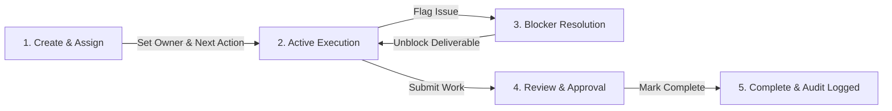

# GNT Task Ownership & System Accountability

A comprehensive enterprise deliverable management and operational tracking system built to enforce single accountability, eliminate operational bottlenecks, and provide real-time visibility across projects, teams, and client commitments.

---

## Overview

Modern organizations often struggle with fragmented execution: tasks lack clear single owners, deadlines slide without warning, and operational blockers remain hidden until project timelines are compromised. **GNT Task Ownership System** solves these challenges by establishing a structured governance framework where every deliverable is bound to a single accountable owner, a strict due date, and a mandatory immediate next action.

By moving away from passive task tracking toward proactive operational accountability, the platform provides administrators and managers with real-time insight into team capacity, active project delivery status, and critical operational risks. Early blocker detection ensures that team members can flag impediments immediately, enabling leaders to step in before project deadlines are impacted.

The system connects project planning with daily execution through integrated document attachments, automated notification alerts, historical activity auditing, and customizable performance analytics. Whether managing ongoing enterprise client contracts or internal technical operations, the platform delivers the structure required to maintain velocity and operational rigor.

---

## Key Features

- **Single Accountability & Deliverable Governance** — Ensures every task is assigned to exactly one primary owner with a fixed due date and a mandatory immediate next action, eliminating shared-responsibility ambiguity across team projects.
- **Early Blocker Detection & Attention Dashboard** — Highlights critical operational risks, overdue deadlines, and blocked tasks in a dedicated administrative attention card, allowing management to resolve impediments before SLA breaches occur.
- **Team Workload & Capacity Distribution** — Displays real-time operational capacity and workload distribution across managers and employees, preventing burn-out and helping leaders assign new deliverables balanced against existing commitments.
- **Client & Project Delivery Tracking** — Groups operational tasks under centralized projects and client profiles, providing real-time completion metrics, status breakdown, and overall progress tracking across active work streams.
- **Document & Artifact Attachment Management** — Supports attaching technical specifications, Product Requirement Documents (PRDs), Functional Requirement Documents (FRDs), and design assets directly to deliverable cards for clear contextual handoffs.
- **Audit Logging & Activity History** — Records a complete, tamper-proof activity trail of all task creations, ownership transfers, status changes, and priority modifications for complete accountability and administrative compliance.
- **Integrated Notification Center** — Automatically alerts team members and managers about new task assignments, upcoming deadlines, overdue warnings, blocker flags, and items returned for administrative review.
- **Performance Analytics & Monthly Reporting** — Generates filterable performance summaries, on-time completion rates, and historical analytics by month, project, employee, or priority level, exportable for operational reviews.
- **Role-Based Security & Access Control** — Restricts system administrative capabilities, team management, and role configuration using three distinct access tiers (**Admin**, **Manager**, and **Employee**) secured via individual PIN authentication.

---

## How It Works

The platform aligns team deliverables across three interconnected stages: assignment, execution, and review.

1. **Task Assignment & Governance**: An Administrator or Manager creates a task, links it to a Client Project, sets a hard due date, assigns a **single accountable owner**, and defines the immediate next physical or logical action required.
2. **Execution & Blocker Management**: The assigned employee works on the deliverable. If an unexpected obstacle arises, the employee updates the status to `BLOCKED` and logs the exact blocker reason, immediately alerting managers via the Attention Dashboard.
3. **Review & Audit Completion**: Upon completing the deliverable scope, the employee submits the task for `REVIEW`. The manager verifies the acceptance criteria and marks the item `DONE`, automatically timestamping completion and recording the activity in the audit history.

---

## Who It's For

The system supports structured operational workflows across three core user roles:

* **Administrators** — Executive leaders and ops directors who oversee entire team operations, manage employee activation, configure user roles, monitor system audit logs, and analyze cross-departmental performance metrics.
* **Managers** — Team leads and project managers responsible for assigning task ownership, monitoring project delivery schedules, resolving flagged blockers, and reviewing completed deliverables.
* **Employees** — Individual contributors who manage their daily task queue, execute defined next actions, attach supporting documentation, and flag operational blockers in real time.

---

## Project Status

The repository contains a fully functional, production-ready frontend web application equipped with responsive dashboards, interactive task management workflows, document attachment support, real-time filtering, role-based navigation views, and integrated backend database persistence via Supabase.

---

## Related Resources

* **Application Context & State Model** — Documented in `src/context/AppContext.tsx` and `src/types/index.ts`.
* **Database & Storage Layer** — Backend data models and Supabase cloud synchronization defined in `src/services/storageService.ts` and `src/services/supabaseClient.ts`.
